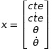
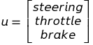
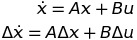
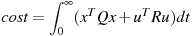
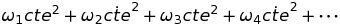
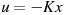

# Notes From Udacity Free Course
## Mapping
- HD map: high definition map, cm level precision.
- ROI: region of interest.
- GNSS: Global Navigation Satellite System, GPS is the most popular GNSS.
- GPS: frequency is about 10 Hz, 1-3 meters precision.
- RTK: Real time kinematics positioning.
- IMU: Inertial Measurement Unit.
    - is used by survey vehicles to map the environment.
    - Accelerometer + gyroscope.
    - high frequency update, up to 1000 Hz.
    - Motion error increases with time. Need to be combined with GPS.

## Localization
- LiDAR Localization
    - ICP (Iterative Closest Point)
        - For a point in 1 scan, find another matching point in the other scan.
        - Compute average distance error by rotating and translating the point clouds.
    - Histogram Filter
        - Also called Sum of Squared Difference (SSD).
        - Slide the point cloud scan from the sensor across every position on the map.
    - Kalman Filter
        - Predict our current state based on our past state and new sensor measurements.
        - Predict State     <----->    Update Measurement
- Visual Localization
    - Uses Particle Filter.
    - Images are easy to obtain.
    - Lack of 3D information and need to rely on 3D maps.
- Apollo Localization

    ```
    Kalman Filter                       Inertial Navigation  
                              prediction  |         ^  
                                          V         | update
    GNSS Localization         ->        Position, Velocity  
    LiDAR Localization        ->        Position, Heading
    ```
    - Inertial Navigation solution is used for the prediction step of the Kalman Filter.
    - GNSS and LiDAR are used for the update step of the Kalman Filter.

## Perception
- Perception task for a self-driving car:
    - Detection: where an object is in the environment.
    - Classification: what the object is.
    - Tracking: observing moving objects across time.
        - tracking handles occlusion (fail of detection), preserves identity.
    - Semantic Segmentation: match each pixel with a semantic category.
        - FCN: fully convolutional network
            - Replace the flat layers at the end of a traditional CNN with convolutional layers
            - Encoder + Decoder
- Classification
    - Input data
    - Preprocessing
    - Extract feature
    - Classification model
- ML/DL training steps:
    - Feed forward
    - Error measurement
    - Back propagation
- RADAR
    - RAdio Detection And Ranging
    - Uses Doppler effect to measure speed directly while other sensors calculate
     speed based on two readings.
    - Because Radar waves bounces off hard surfaces, they can provide measurements
     to objects without direct line of flight.
    - Low resolution.
    - Not sensitive to weather.
- LiDAR
    - Light Detection And Ranging
    - Uses an infrared laser beam (wave length about 900 nm).
    - Has a much higher spatial resolution than Radar.

## Prediction
- Model-based Prediction
    - Analytical based on equations.
- Data-driven Prediction
    - More data, more accurate.
- Apollo: Lane-sequence-based prediction
    - Predict the probability of the obstacle to follow a lane sequence based on
    RNNs trained from lane sequences and obstacle status.

## Planning
- Overall planning structure

    ```
    (map, start, goal)    -->   Route Navigation    -->   High level route planning (A*)
                                      |
                                      V
                                Trajectory planning -->   A sequence of collision free points
    ```

- Trajectory generation needs to consider:
    - Collision free
    - Passenger comfort
    - Trajectory physically viable for the car
    - Obey laws
-  **Use cost function to choose the best trajectory**
    - Deviation from the center of lane
    - Collisions
    - Speed limit
    - Passenger comfort
- Path-Velocity decoupled planning
    - Path planning + speed planning
        - Path planning: segment the road into cells, randomly sample points from each
        of these cells. Connect these points to create candidate paths, evaluate paths
         using cost functions.
        - speed planning: ST-graph, S: longitudinal distance. Use quadratic programming
        to smooth the path and speed profile.
- Lattice Planning
    - Lateral offset relative to the longitudinal trajectory: S-L graph
    - S-T graph
    - Generate ST and SL trajectories independently and then combining them
    - ending states:
        - cruising
        - following
        - stopping
    - Once we have ST and SL trajectories, we can transform them back to the Cartesian
     coordinate frame. Then we can combine them to construct a 3D trajectory composed
     of 2D way points and 1D time stamps.

## Control
Use variable control inputs to minimize deviation from target trajectory and maximize
passenger comfort.
- PID
    - equation:
        - 
    - Disadvantages
        - Just a linear algorithm, insufficient for complex problems.
        - For self driving car, we need different PID controllers for steering and
        acceleration, it is hard to combine a latitudinal and a longitudinal control.
        - PID depends on real-time error measurement, it may fail when it subjects to
         measurement delays.
- LQR
    - Linear quadratic regulator
    - Model-based controller uses the state of the vehicle to minimize error.
    - Used for lateral control which has four inputs:
        - lateral error
        - rate of change of lateral error
        - heading error
        - rate of change of heading error
    - state
          - 
    - control input
        - 
    - Model
        - 
    - Cost
        - 
        - will be something like:
            - 
    - Objective
          - 
          - find optimal K


- MPC
    - Build a model of the vehicle.
    - Use an optimization engine to calculate control inputs over a finite time horizon.
    - Implement the first set of control inputs.
    - Need to decide on how far into the future we want MPC to look.
        - Need to tradeoff accuracy with how quickly we need to get a result.
    - `(Vehicle state + Control inputs)  -->  Vehicle model  --> Vehicle Trajectory    `
    - Advantage:
        - Takes vehicle model, more accurate than PID
        - Work with different cost functions
    - Disadvantage:
        - Complex, slower, harder to implement

# My notes when reading Apollo code
## Control
- What is steer_ratio?
    - The turn of the steering wheel and the turn of the wheels.
- `steer_single_direction_max_degree`
    - It is the maximum turn of steering wheel, not the maximum turn degree.
    - about 470 in apollo configuration file
    
