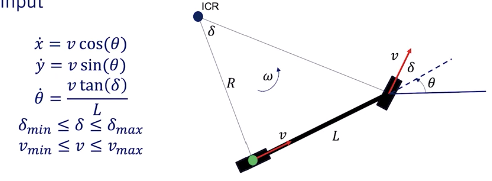
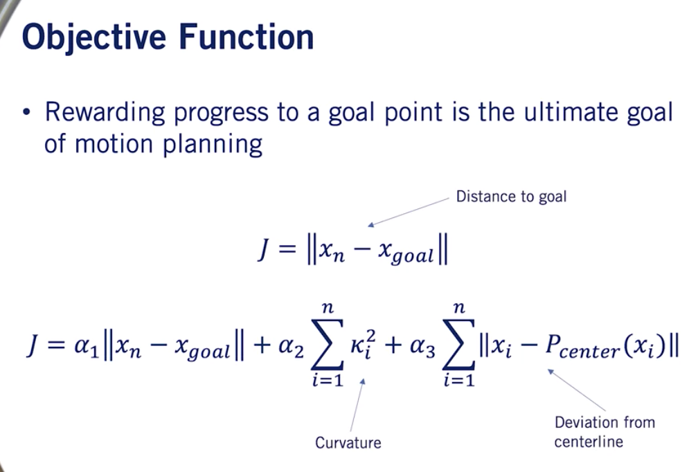
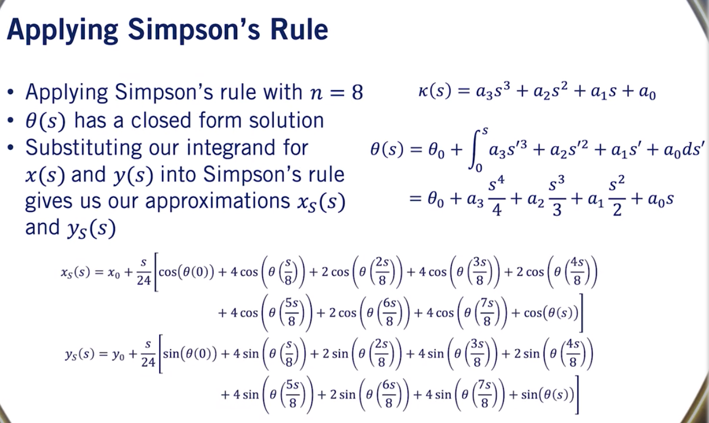
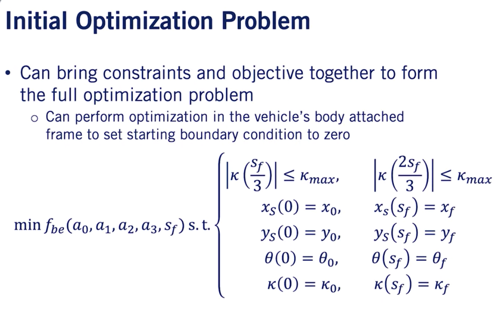
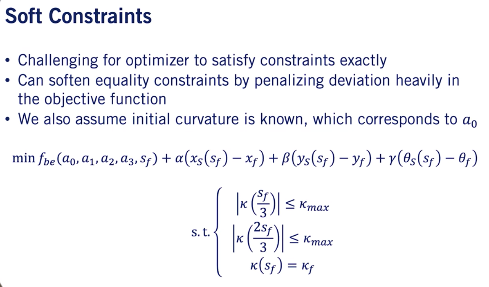
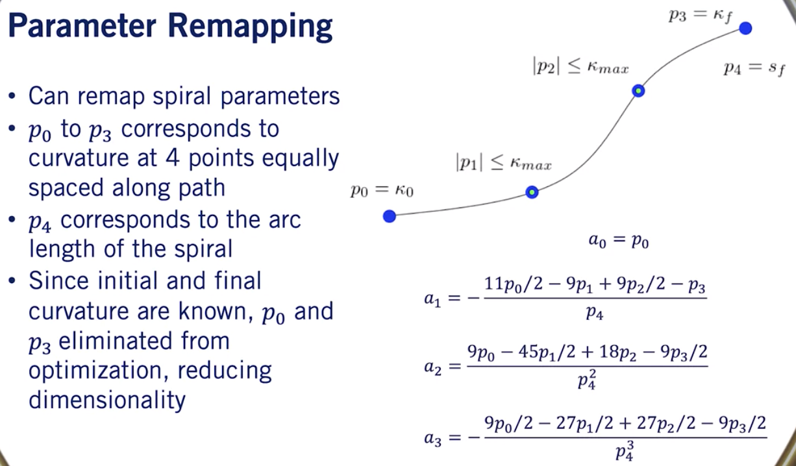
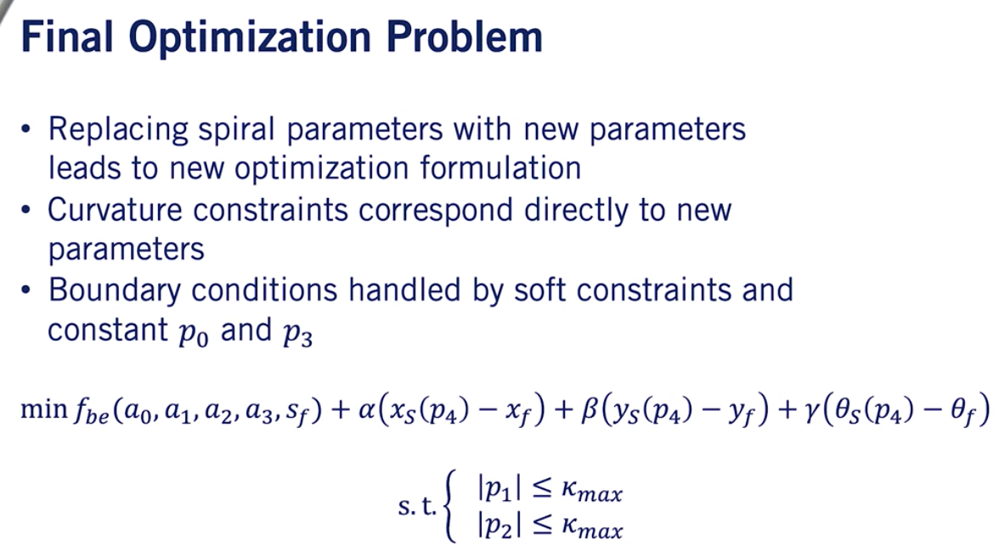

# Week 1
## On road scenarios
- Road structure scenarios
- Obstacle scenarios
## Hierarchical Planning

- Mission planner
	- highest level, focuses on map-level navigation
	- abstract away lower level details
	- can be solved with graph-based algorithms (dijkstra, A\*)
- Behavioural planner
	- focuses on other agents (pedestrians, vehicles, cyclists), rules of the road, driving behaviors
	- decides when it is safe to proceed
	- active research area, mainly 3 architectures
		- Finite state machines
			- States are based on perception of surroundings
			- Transitions are based on inputs to the driving scenarios
			- MemoryLess, do not depends sequence of past states 
		- Rule-based system
			- Uses a hierarchy of rules to determine the output behaviour
			- Rules are evaluated based on logical predicates
		- Machine learning
			- Reinforcement Learning
- Local planner
	- focuses on generating feasible, collision-free paths
	- 3 approaches
		- Sampling-based planners
			- Randomly sample the control inputs to quickly explore the workspace
			- Collision-checking is performed as new points are added to the explored space
			- Often very fast, but can generate very poor-quality paths 
			- Example: RRT (Rapidly Exploring Random Tree)
		- Variational planners
			- Optimize trajectory according to cost functions
			- Can be slower, less likely to converge to a feasible solution
			- Sensible to initial conditions
			- Example: CHOMP (Covariant Hamiltonian Optimization for Motion Planning)
		- Lattice Planners
			- Constrain the search space by limiting available actions available to the robot
				- Set of actions are known as control set
			- Layers of Control actions form a graph, which can be searched by Dijkstra or A*
			- Conforming lattice planner fits the control acions to the road structure
		
## Motion Planning Constraints
- Vehicle kinematics and dynamics
	- Kinematics simplified to bicycle model
		- Bicycle model imposes curvature (k = 1 / r) constraint on path planning process
		- Curvature constraint is non-holonomic
			- Non-holonomic means, the constraint doesn't only depend on the state of the robot but also how the robot got to this state.
			- Reduce the number of directions a mobile robot can travel at any time.
	- Dynamics
		- Friction ellipse denotes maximum magnitude of tire forces before stability loss
		- Friction forces are extreme limit, more useful constraint is accelerations tolerable by passengers
		- Dynamic and curvature
			- Friction limits and comfort restrict lateral acceleration
				- lateral acceleration is a function of instantaneous turning radius of path and velocity
				- $a_{lat} = \frac{v^2} {r}$, $a_{lat} <= a_{latMax}$
				- $ k = 1 / r $
				- $ v^2 <= \frac{a_{latMax}} {k} $
- Static and dynamic obstacles
	- Static obstacles block portions of workspace
		- occupancy grid encoding stores obstacle locations
	- Static obstacle constrains satisfied by performing collision checking
	- Dynamic obstacles will constrain both our behavior planning process, where we make maneuver decisions, as well as our local planning process, where it will affect our velocity profile planning.
- Rules of Roads and Regulatory elements
	- Lane constraints restrain path locations
	- Signs, traffic lights influence vehicle behavior

## Objective functions for motion planning
- Efficiency
	- Path length (arc length) $$ s_f = \int_{x_i}^{x_f} \sqrt{1 + {\left(\frac{dy} {dx}\right)}^2 } dx $$
	- Travel time
		- $$ T_f = \int_{0}^{s_f} \frac{1}{v(s)} ds $$		
		- minimize trave time to destination while following planned path
	- Reference tracking: penalize deviation from referenced path and velocity profile
- Smoothness (reduce jerk)
	- $$ \int_{0}^{s_f} || \dddot{x}(s) ||^2 ds$$
- Curvature
	- $$ \int_{0}^{s_f} || \kappa (s) ||^2 ds $$

# Week 2 Mapping for Planning
## Environmental maps
### Occupancy grid map
- Assumptions
	- static environment
	- Independence of each cell
	- Known vehicle state at each time step
- belief map: occupancy grid map stores probability of a cell being occupied due to sensor noise
- Create occupancy grid map from lidar scan data
	- Issue with standard bayesian update
		- $bel_t(m) = n \cdot p(y_t | m) \cdot bel_{t-1}(m)$ 
		- Multiplication of numbers close to zero is hard for computers
	- Store the log odds ratio rather than probability
		- $logit(p) = \frac{p} {1 - p} $
		- Convert logit back to p: $p = \frac{e^{logit(p)}} {1 + e^{logit(p)}}$
- Bayesian log odds update 
	- $l_{t, i} = logit(p(m^i | y_t)) + l_{t-1, i} + l_{0, i}$
	- $l_{t-1, i} = logit(p(m^i | y_{1:t-1}))$ is the previous belief at $t-1$ for cell $i$
	- $p(m^i | y_t)$ is the inverse measurement model
	- $l_{0, i}$ is the initial belief at time 0 for cell $i$
- Bayesian log odds update has two advantages:
	- numerically stable
	- computationally efficient
#### Inverse measurement model
- In occupancy grid map, 3 types: no information, low probability, high probability
- Parameters: $\alpha$ affected range for high probability, $\beta$ affected angles for low and high probability 
- To increase computation speed, use ray tracing algorithm: Bresenham's line algorithm
	- Perform update on each beam from the Lidar rather than each cell on the grid
		- Performs far fewer updates (ingores no information zone)
		- Much cheaper per rotation
#### Filtering 3D lidar data
- Downsampling
	- E.g. take every 10th point
- Filter out lidar points above the autonomous car
- We remove all Lidar points which have hit the drivable surface or ground plane.
	- Difficult due to several complications
		- Differing road geometries
		- Curbs, lane boundaries
		- Don't want to miss small objects on roads
	- Take advantages of segmentation to remove points of road elements, keep points from non-drivable surfaces
- Remove all dynamic objects
	- Not all vehicles are dynamic, so they should be included.
	- History of dynamic object location can be used to identify parked vehicle
	- The dynamic objects are identified from previous lidar frame
#### Projection of 3D Lidar onto 2D plane
- Simple solution:
	- Collapse all points by zeroing the Z coordinate
	- Sum up the number of lidar points in each grid location
		- More points indicated greater chance of occupation of that grid cell
### High-definition road map (lanelet map)
- lanelet element
	- Defines the following
		- left and right boundaries
		- Regulations
			- Elements
			- Attributes
		- Connectivity to other lanelets
	- A new lanelet is created when a new regulatory element is encountered or ends
- Operations done on lanelets
	- Path planning through complex road networks
	- Localize dynamic objects
	- Interactions with other dynamic objects

# Week 3 Mission Planning in Driving Environments
## Creating a road network graph
- For an unweighted, directed graph, use BFS to find the shortest path
- Vertices represent intersections, edges represent road segments
## Dijkstra's shortest path search
- For weighted graphs, we need to use dijkstra's algorithm to search shortest path which uses a minHeap to always choose the vertex whose path cost is the lowest.
## A* Shortest path search
- Admissible heuristic cost: the cost heuristic should be always less than or equal to the actual cost
- If we choose the heuristic cost to be 0 everywhere, then A* becomes Dijkstra's algorithm
- How to apply A* involving time instead of distance
	- Use lower bound of time of travel by assuming maximum speed over euclidean distance

# Week 4 Dynamic Object Interactions
## Requirements for motion prediction models
- Mandatory requirements
	- class of dynamic objects
	- current heading, position and velocity
- Optional requirements
	- history of the position, heading and velocity
		- requires object tracking between identifications over a set amount of time
	- current high-definition map
## Simplification of motion prediction - cars
- Physics-based assumptions
- Maneuver-based assumptions
- Interactions-aware assumptions
## Complexities of motion prediction - pedestrians
- Pedestrians are unpredictable
- Can rapidly change speed and heading
- Pedestrians have right of way, but will stop if threatened.
## Constant velocity prediction issues
- Don't account for vehicle dynamics fully
- Don't account for the road (position adjustment)
- Don't account for road signs (velocity adjustment)
- Assumptions are too strong and incorrect for most dynamic object motion
## Map-aware motion prediction
### Assumptions to improve motion prediction
- Positional Assumptions
	- Vehicles on lane usually follow the given drive lane
	- Changing drive lanes is usually prompted by an indicator signal
- Velocity Assumptions
	- Vehicles usually modify their velocity when approaching restrictive geometry (tight turns)
		- Maximum lateral acceleration
	- Vehicles usually modify their velocity when approaching regulatory elements
		- Stop locations, deceleration profile
		- Lanelet priors	
- Issues with the assumptions
	- Difficult to predict lane change without extra information
	- Difficult to predict for cases when there are multiple possible lanes
		- Solution
			- Most likely prediction
			- Multi-hypothesis prediction
				- consider the range of all possible motions
				- provide more information(ambiguous) to local planner
				- safer due to human error (forgotten turn signal)
	- Vehicles don't always stay within their lane or stop at regulatory elements
	- Vehicles off of the road cannot be predicted using this method
## Time to collision
- Time to collision is comprised of 
	- Collision point between the two dynamic objects
	- Prediction of the time to arrive to the collision point
- Requirement for accuracy
	- Accurate predicted trajectories for all dynamic objects(positions, heading and velocity)
	- Accurate dynamic object geometries
### Two ways to compute time to collision: simulation-based and estimation-based
- Estimation-based approach
	- Geometries of the vehicle are approximated over duration of the predicted path
	- Collision point is estimated based the cars' predictions

# Week 5 Principles of Behavior Planning
## Behavior planning
- A behavior planning system plans the set of high level driving actions, or maneuvers to safely achieve the driving mission under various situations
- Behavior planner considers
	- Rules of the road
	- Static objects around the vehicle
	- Dynamic objects around the vehicle
- Driving maneuvers
	- Track speed
	- Follow leader
	- Decelerate to stop
	- Stop
	- Merge
- Output of Behavior Planner
	- Driving maneuver to be executed
	- Set of constraints which must be obeyed by the planned trajectory of the self-driving car which include:
		- Ideal path
		- Speed limit
		- Lane boundaries
		- Stop locations
		- Set of interest vehicles
- Input Requirements
	- HD map
	- Mission path
	- Localization information
	- #### perception information
		- All observed dynamic objects
			- Prediction of future movement
			- Collision points and time to collision
		- All observed static objects
			- Road signs
		- Occupancy grid
- Finite state machines
	- Each state is a driving maneuver
	- Transitions define movement from one maneuver to another
	- Transitions define the rule implementation that needs to be met before a transition can occur
	- Entry action are modifications to the conditions
	- #### Advantages
		- Limiting number of rule checks
		- Rule become more targeted and simple
		- Implementation of the behavior planner becomes simpler
## Behavior planning testing
- Code based tests
	- To confirm the logic of the code is correct
- Simulation tests
	- Inside simulator, check whether the state machine performs the scenarios which it was designed to handle.
	- This type of testing is able to confirm if the state machine transitions and state coverage are correct.
	- The number of tests performed in the simulation should be representative of all possible situations which can be seen when driving the scenario to catch any edge cases which programmers might have missed.
		- Many times selecting a representative set of tests is not trivial, especially as the complexity of the scenarios increases.
- Private track tests
	- This type of testing tests specific scenarios which are hard to confirm exactly in simulation, such as parameter tuning and noise, and errors in the perception output in a real environment. 
- Limited scope close supervision road tests
### Dynamic Object Edge Cases not handled
- Assumption
	- All dynamic obstacles obey rules of the traffic
- Not always the case.

## Handling multiple scenarios
- Single state machine
	- Add transitions
	- Add additional transition conditions
	- Issues
		- Rule explosion
		- Increase in computational time
		- Complicated to create and maintain
- Multiple state machines
	- Use a super state to represent a scenario, also known as Hierachical State Machine
	- Introduce entry and exit transitions to transit among super states
	- Advantages
		- Decrease in computational time
		- Simpler to create and maintain
	- Disadvantages
		- Rule Explosion
			- still unable to handle rule explosion completely.
		- Repetition of many rules in the low level state machines 
## Advanced methods for behavior planning
- #### State machine behavior planning issues
	- Rule-explosion when dealing with complex scenarios
	- Dealing with a noisy environment
	- Hyperparameter tuning
	- Incapable of deadling with unencountered scenarios
- Rule-based behavior planner
	- Hierarchy of rules
		- Safety critical
		- Defensive driving
		- Ride comfort
		- Nominal behaviors
	- Reduced need for duplication
		- Rules can apply throughout the ODD (what is this?)
	- Suffer from same challenges as finite state machines
		- Common to all expert system designs
- Fuzzy logic
	- While Fuzzy based rule systems are able to deal with the environmental noise of a system to a greater degree than traditional discreet systems. Both rule-explosion and hyperparameter tuning remain issues with Fuzzy systems.
- Reinforcement Learning
	- Hierarchical RL
	- Model-based RL
	- Issues
		- Simple simulation environments
			- Many simulation environments used to learn the policies required for autonomous driving are overly simplified. And due to their simplicity the policies learned may not be transferable to real world environments. Overly realistic simulators lead to the issue of severe computational requirements. Especially when running thousands of repetitions of widely varying scenarios for self driving learning.
		- Ensuring safety
			- There is still no way to perform rigorous safety assessment of a learned system, as they are mostly black boxes in terms of the way in which decisions are made. 
- Inverse Reinforcement Learning
	- Get reward function from human-driving data
- End-to-End approaches: raw sensor data -> throttle, steering 

# Week 6 Reactive path planning in static environments
## Trajectory propogation
### Kinematic vs. Dynamic Model
#### Particle Kinematic Model
$$\ddot{x} = a$$
- Disregards mass and inertia of the robot
- Uses linear and angular velocities (and/or derivatives) as input
#### Particle Dynamic Model
$$M\ddot{x} + B\dot{x} = F$$
- Takes mass and inertia into consideration
- Uses forces and torques as inputs
#### Kinematic Bicycle Model
- $x$ and $y$ correspond to base link position of the robot
- $\theta$ corresponds to heading of the chassis with respect to x-axis
- Inputs: $\delta$ is the steering angle input, $v$ is the velocity input
- No consideration of higher-order terms

#### Varying input for obstacle avoidance 
- To avoid obstacles, we require more complex maneuvers
- We can vary the steering input according to a steering function to navigate complex scenarios
- Main objective of local planning is to compute the control inputs (or trajectory) required to navigate to goal point without collision
## Collision checking
### Swath computation
- Area occupied by car along path generated by rotating the car's footprint by each $x, y, \theta$ along the path
- Swath along path is the union of each rotated and translated footprint
- Swath can then be checked for collisions
$$\mathcal{S} = U_{p \in P}F(x(p), y(p), \theta(p)) $$
#### Lattice planner swaths
- Swath based methods are useful for lattice planners, as the swath sets can be computed offline
- Online collision checking is then simplified using lookup tables
### Conservative approximations
- Conservative approximations may report a collision even if there isn't one, but will never miss a collision if it were to actually happen.
- The car can be completely encapsulated by three circles.
#### Circle collision checking
- Circle approximation is effective since it is fast to check if an occupancy grid point lies within a circle of radius $r$ centered at $(x_c, y_c)$
- If obstacle in occupancy grid lies within circle, a collision is reported
> One thing to realize about conservative approximations, is that they may eliminate all feasible collision-free paths from a problem even though a path exists or eliminate safe passages through narrow openings. This can cause the planner to get stuck when it shouldn't or can cause the planner to compute a much more circuitous route than is necessary. 
## Trajectory Rollout Algorithm
### Trajectory rollout planner
- Uses trajectory propagation to generate candidate set of trajectories
- Among collision-free trajectories, select trajectory that makes the most progress to goal
#### Trajectory set generation
- Each trajectory corresponds to a fixed control input to our model
	- Typically uniformly sampled across range of possible inputs
- More sampled trajectories leads to more maneuverability
- Fewer sampled trajectories improves computation time

#### Receding horizon planner example
- Only 1s of 2s trajectory is executed at each planning iteration
- Planning horizon end time recedes towards time point at which the goal is reached
#### The planner is greedy and sub-optimal, but is fast enough to allow for online planning, short-sighted.
## Dynamic Windowing
> Dynamic windowing will allow us to place linear and angular acceleration constraints on the vehicle's trajectory, in order to promote comfort as the vehicle progresses between planning cycles.
### Constraint in terms of steering angle
- Angular acceleration constraint may prevent us from selecting certain maneuvers based on current angular velocity
- Change in steering angle between planning cycles is bounded
- Similar logic applies for changes in linear velocity inputs between planning cycles
$$ \dot{\theta} = \frac{v\cdot tan(\delta)} {L}$$
$$ |\ddot{\theta}| = \left| \frac{\dot{\theta_2} - \dot{\theta_1}} {\Delta t} \right| $$
$$ |tan(\delta_2) - tan(\delta_1)| \le \frac{\ddot{\theta}_{max}\cdot L \cdot \Delta t} {v} $$

# Week 7 Smooth Local Planning
## Parametric curves
- The first step in understanding the path planning problem is to first understand its most fundamental requirements. 
	- For the path planning problem, this is given a starting position, heading, and curvature, find a path to an ending position heading and curvature that satisfies our kinematic constraints. 
	- In the context of an optimization, the starting and end values can be formulated as the boundary conditions of the problem, and the kinematic motion of the vehicle can be formulated as continuous time constraints on the optimization variables. 
	- In this context, the boundary conditions are the conditions that must hold on either end point of the path for a given optimization solution to be considered feasible. If these boundary conditions are violated, no matter how great the path is, we haven't achieved our core objective of actually getting to the point we want to get to. So the path is not useful to us. 
	- These boundary conditions will influence how we decide to set up the underlying structure of the optimization problem. 
- #### Kinematic Constraints
	- Maximum curvature along path cannot be exceeded
	- Ensures that car can drive along path
- #### Parametric curves
	- Parametric curve $r$ can be described by a set of parameterized equations
	- Parameter denotes path traversal, can be arc length or unitless
- Path optimization
	- Want to optimize path according to cost function $f$
	- Parametric curves allow for optimizing over parameter space, which simplifies optimization formulation

min $f(r(u))\ s.t.$ 
$$c(r(u)) \le \alpha, \forall u \in [0, 1]$$ 
$$r(0) = \beta_0$$ 
$$r(u_f) = \beta_f $$
- Non-parametric path
	- Reactive planner used non-parametric paths underlying each trajectory
		- Path was represented as a sequence of points rather than parameterized curves
- Two common types of path parameterizations
	- Quintic splines
		- $x$ and $y$ are defined by $5th$ order splines
		- Closed form solution available for $(x, y, \theta, k)$ boundary conditions
		- Chanllenging to constrain curvature due to the nature of spline's curvature
			- pontential discontinuities in curvature or its derivatives
			- $\kappa (u) = \frac{x'(u) y''(u) - y'(u) x''(u)} {(x'(u)^2 + y'(u)^2)^{\frac{3}{2}}}$
	- Polynomial spirals
		- Spirals are defined by their curvature as a function of arc length
		- Closed form curvature definition allows for simple curvature constraint checking
			- Curvature is well-behaved between sampled point as well due to polynomial formulation
		- Downsides
			- Spiral position does not have a closed form solution
			- Fresnel integrals need to evaluated numerically, this can be done using Simpson's rule
	> The spline provides closed form solutions based on start and end points alone, whereas the spiral does not. The spiral ensures smooth curvature variation along the path, while the spline does not. You will therefore need to determine which method is appropriate depending on your specific application. As a brief shorthand, the spline leads to computational efficiency, while the spiral leads to easier implementation of curvature constraints. 
## Path planning optimization
- Cubic spiral and boundary conditions
	- Boundary conditions specify starting state and required ending state
	- Spiral end position lacks closed form solution, requires numerical approximation
	- start: $(x_0, y_0, \theta_0, \kappa_0)$, end: $(x_f, y_f, \theta_f, \kappa_f)$
	- $\kappa(s) = a_3 s^3 + a_2 s^2 + a_1 s + a_0$
	- $x(s) = x_0 + \int_0^s cos(\theta(s')) ds' $
	- $y(s) = y_0 + \int_0^s sin(\theta(s')) ds' $ 
- Position integrals and simpson's rule
	- Simpson's rule has improved accuracy over other methods
		- it evaluates the integral of the quadratic interpolation of the given function rather than the integral of the linear interpolation as in some methods such as midpoint and trapezoidal rules. Simpson's rule proceeds by defining a number of equally spaced divisions of the integration domain defined by n, and then summing terms at each division and boundary point.
	- Divides the integration into $n$ regions and evaluates the function at each region boundary

- Boundary conditions via Simpson's Rule
	- Using our Simpson's approximations, we can now write out the full boundary conditions in terms of spiral parameters
	- Can now generate a spiral that satisfies boundary conditions by optimizing its spiral parameters and its length, $s_f$
- Approximate curvature constraints
	- Want to apply curvature constraints to path so it is drivable by the vehicle
	- Curvature constraints correspond to minimum vehicle turning radius
	- Can constrain sampled points along the path due to well-behaved nature of spiral's curvature
- #### Bending Energy Objective
$$ f_{be}(a_0, a_1, a_2, a_3, s_f) = \int_0^{s_f} (a_3s^3 + a_2s^2 + a_1s + a_0)^2 ds$$
	- Bending energy distributes curvature evenly along spiral to promote comfort
		- Equals to integral of square curvature along path, which has closed form for spirals
	- Gradient also has a closed form solution
		- Has many terms, it is best to left to symbolic solver

- Because equality constraints must be satisfied exactly, it is quite hard for a numerical optimizer to generate a feasible solution from an infeasible starting point which is often what is given to the optimizer for an arbitrary problem instance. To alleviate this issue, it is common in optimization to soft inequality constraints to improve optimizer performance.

- Parameter remapping to expedite convergence

