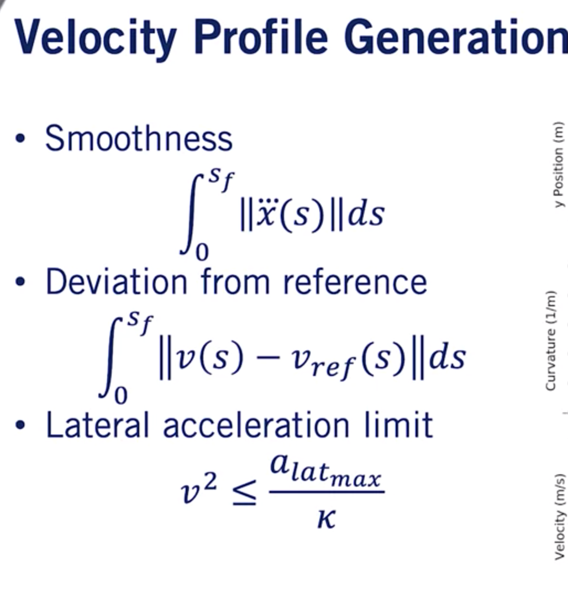
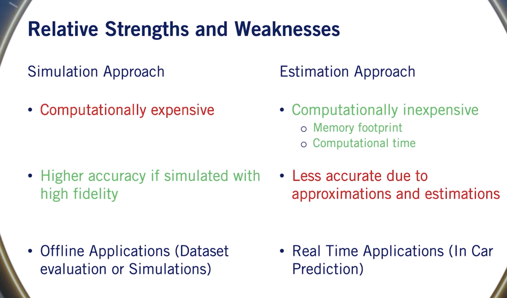

# Week 1
## On road scenarios
- Road structure scenarios
- Obstacle scenarios
## Hierarchical Planning

- Mission planner
	- highest level, focuses on map-level navigation
	- abstract away lower level details
	- can be solved with graph-based algorithms (dijkstra, A\*)
- Behavioural planner
	- focuses on other agents (pedestrians, vehicles, cyclists), rules of the road, driving behaviors
	- decides when it is safe to proceed
	- active research area, mainly 3 architectures
		- Finite state machines
			- States are based on perception of surroundings
			- Transitions are based on inputs to the driving scenarios
			- MemoryLess, do not depends sequence of past states 
		- Rule-based system
			- Uses a hierarchy of rules to determine the output behaviour
			- Rules are evaluated based on logical predicates
		- Machine learning
			- Reinforcement Learning
- Local planner
	- focuses on generating feasible, collision-free paths
	- 3 approaches
		- Sampling-based planners
			- Randomly sample the control inputs to quickly explore the workspace
			- Collision-checking is performed as new points are added to the explored space
			- Often very fast, but can generate very poor-quality paths 
			- Example: RRT (Rapidly Exploring Random Tree)
		- Variational planners
			- Optimize trajectory according to cost functions
			- Can be slower, less likely to converge to a feasible solution
			- Sensible to initial conditions
			- Example: CHOMP (Covariant Hamiltonian Optimization for Motion Planning)
		- Lattice Planners
			- Constrain the search space by limiting available actions available to the robot
				- Set of actions are known as control set
			- Layers of Control actions form a graph, which can be searched by Dijkstra or A*
			- Conforming lattice planner fits the control acions to the road structure
		
## Motion Planning Constraints
- Vehicle kinematics and dynamics
	- Kinematics simplified to bicycle model
		- Bicycle model imposes curvature (k = 1 / r) constraint on path planning process
		- Curvature constraint is non-holonomic
			- Non-holonomic means, the constraint doesn't only depend on the state of the robot but also how the robot got to this state.
			- Reduce the number of directions a mobile robot can travel at any time.
	- Dynamics
		- Friction ellipse denotes maximum magnitude of tire forces before stability loss
		- Friction forces are extreme limit, more useful constraint is accelerations tolerable by passengers
		- Dynamic and curvature
			- Friction limits and comfort restrict lateral acceleration
				- lateral acceleration is a function of instantaneous turning radius of path and velocity
				- $a_{lat} = \frac{v^2} {r}$, $a_{lat} <= a_{latMax}$
				- $ k = 1 / r $
				- $ v^2 <= \frac{a_{latMax}} {k} $
- Static and dynamic obstacles
	- Static obstacles block portions of workspace
		- occupancy grid encoding stores obstacle locations
	- Static obstacle constrains satisfied by performing collision checking
	- Dynamic obstacles will constrain both our behavior planning process, where we make maneuver decisions, as well as our local planning process, where it will affect our velocity profile planning.
- Rules of Roads and Regulatory elements
	- Lane constraints restrain path locations
	- Signs, traffic lights influence vehicle behavior

## Objective functions for motion planning
- Efficiency
	- Path length (arc length) $$ s_f = \int_{x_i}^{x_f} \sqrt{1 + {\left(\frac{dy} {dx}\right)}^2 } dx $$
	- Travel time
		- $$ T_f = \int_{0}^{s_f} \frac{1}{v(s)} ds $$		
		- minimize trave time to destination while following planned path
	- Reference tracking: penalize deviation from referenced path and velocity profile
- Smoothness (reduce jerk)
	- $$ \int_{0}^{s_f} || \dddot{x}(s) ||^2 ds$$
- Curvature
	- $$ \int_{0}^{s_f} || \kappa (s) ||^2 ds $$

# Week 2 Mapping for Planning
## Environmental maps
### Occupancy grid map
- Assumptions
	- static environment
	- Independence of each cell
	- Known vehicle state at each time step
- belief map: occupancy grid map stores probability of a cell being occupied due to sensor noise
- Create occupancy grid map from lidar scan data
	- Issue with standard bayesian update
		- $bel_t(m) = n \cdot p(y_t | m) \cdot bel_{t-1}(m)$ 
		- Multiplication of numbers close to zero is hard for computers
	- Store the log odds ratio rather than probability
		- $logit(p) = \frac{p} {1 - p} $
		- Convert logit back to p: $p = \frac{e^{logit(p)}} {1 + e^{logit(p)}}$
- Bayesian log odds update 
	- $l_{t, i} = logit(p(m^i | y_t)) + l_{t-1, i} + l_{0, i}$
	- $l_{t-1, i} = logit(p(m^i | y_{1:t-1}))$ is the previous belief at $t-1$ for cell $i$
	- $p(m^i | y_t)$ is the inverse measurement model
	- $l_{0, i}$ is the initial belief at time 0 for cell $i$
- Bayesian log odds update has two advantages:
	- numerically stable
	- computationally efficient
#### Inverse measurement model
- In occupancy grid map, 3 types: no information, low probability, high probability
- Parameters: $\alpha$ affected range for high probability, $\beta$ affected angles for low and high probability 
- To increase computation speed, use ray tracing algorithm: Bresenham's line algorithm
	- Perform update on each beam from the Lidar rather than each cell on the grid
		- Performs far fewer updates (ingores no information zone)
		- Much cheaper per rotation
#### Filtering 3D lidar data
- Downsampling
	- E.g. take every 10th point
- Filter out lidar points above the autonomous car
- We remove all Lidar points which have hit the drivable surface or ground plane.
	- Difficult due to several complications
		- Differing road geometries
		- Curbs, lane boundaries
		- Don't want to miss small objects on roads
	- Take advantages of segmentation to remove points of road elements, keep points from non-drivable surfaces
- Remove all dynamic objects
	- Not all vehicles are dynamic, so they should be included.
	- History of dynamic object location can be used to identify parked vehicle
	- The dynamic objects are identified from previous lidar frame
#### Projection of 3D Lidar onto 2D plane
- Simple solution:
	- Collapse all points by zeroing the Z coordinate
	- Sum up the number of lidar points in each grid location
		- More points indicated greater chance of occupation of that grid cell
### High-definition road map (lanelet map)
- lanelet element
	- Defines the following
		- left and right boundaries
		- Regulations
			- Elements
			- Attributes
		- Connectivity to other lanelets
	- A new lanelet is created when a new regulatory element is encountered or ends
- Operations done on lanelets
	- Path planning through complex road networks
	- Localize dynamic objects
	- Interactions with other dynamic objects

# Week 3 Mission Planning in Driving Environments
## Creating a road network graph
- For an unweighted, directed graph, use BFS to find the shortest path
- Vertices represent intersections, edges represent road segments
## Dijkstra's shortest path search
- For weighted graphs, we need to use dijkstra's algorithm to search shortest path which uses a minHeap to always choose the vertex whose path cost is the lowest.
## A* Shortest path search
- Admissible heuristic cost: the cost heuristic should be always less than or equal to the actual cost
- If we choose the heuristic cost to be 0 everywhere, then A* becomes Dijkstra's algorithm
- How to apply A* involving time instead of distance
	- Use lower bound of time of travel by assuming maximum speed over euclidean distance

# Week 4 Dynamic Object Interactions
## Requirements for motion prediction models
- Mandatory requirements
	- class of dynamic objects
	- current heading, position and velocity
- Optional requirements
	- history of the position, heading and velocity
		- requires object tracking between identifications over a set amount of time
	- current high-definition map
## Simplification of motion prediction - cars
- Physics-based assumptions
- Maneuver-based assumptions
- Interactions-aware assumptions
## Complexities of motion prediction - pedestrians
- Pedestrians are unpredictable
- Can rapidly change speed and heading
- Pedestrians have right of way, but will stop if threatened.
## Constant velocity prediction issues
- Don't account for vehicle dynamics fully
- Don't account for the road (position adjustment)
- Don't account for road signs (velocity adjustment)
- Assumptions are too strong and incorrect for most dynamic object motion
## Map-aware motion prediction
### Assumptions to improve motion prediction
- Positional Assumptions
	- Vehicles on lane usually follow the given drive lane
	- Changing drive lanes is usually prompted by an indicator signal
- Velocity Assumptions
	- Vehicles usually modify their velocity when approaching restrictive geometry (tight turns)
		- Maximum lateral acceleration
	- Vehicles usually modify their velocity when approaching regulatory elements
		- Stop locations, deceleration profile
		- Lanelet priors	
- Issues with the assumptions
	- Difficult to predict lane change without extra information
	- Difficult to predict for cases when there are multiple possible lanes
		- Solution
			- Most likely prediction
			- Multi-hypothesis prediction
	- Vehicles don't always stay within their lane or stop at regulatory elements
	- Vehicles off of the road cannot be predicted using this method
## Time to collision
- Time to collision is comprised of 
	- Collision point between the two dynamic objects
	- Prediction of the time to arrive to the collision point
- Requirement for accuracy
	- Accurate predicted trajectories for all dynamic objects(positions, heading and velocity)
	- Accurate dynamic object geometries
### Two ways to compute time to collision: simulation-based and estimation-based
- Estimation-based approach
	- Geometries of the vehicle are approximated over duration of the predicted path
	- Collision point is estimated based the cars' predictions

