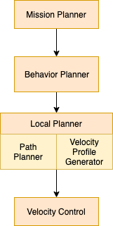

# Week 1
## On road scenarios
- Road structure scenarios
- Obstacle scenarios
## Hierarchical Planning

## Motion Planning Constraints
- Vehicle kinematics and dynamics
	- Kinematics simplified to bicycle model
		- Bicycle model imposes curvature (k = 1 / r) constraint on path planning process
		- Curvature constraint is non-holonomic
			- Non-holonomic means, the constraint doesn't only depend on the state of the robot but also how the robot got to this state.
			- Reduce the number of directions a mobile robot can travel at any time.
	- Dynamics
		- Friction ellipse denotes maximum magnitude of tire forces before stability loss
		- Friction forces are extreme limit, more useful constraint is accelerations tolerable by passengers
		- Dynamic and curvature
			- Friction limits and comfort restrict lateral acceleration
				- lateral acceleration is a function of instantaneous turning radius of path and velocity
				- $a_{lat} = \frac{v^2} {r}$, $a_{lat} <= a_{latMax}$
				- $ k = 1 / r $
				- $ v^2 <= \frac{a_{latMax}} {k} $
- Static and dynamic obstacles
- Regulatory elements
